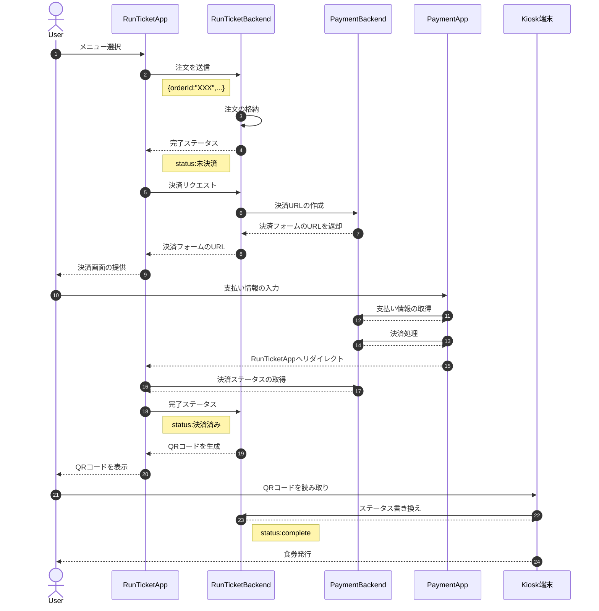

```mermaid
sequenceDiagram
    autonumber
    actor User
    participant client as RunTicketApp
    participant backend as RunTicketBackend
    participant payback as PaymentBackend
    participant payapp as PaymentApp
    participant kiosk as Kiosk端末
    User->>client: メニュー選択
    client->>backend: 注文を送信
    Note left of backend: {orderId:"XXX",...}
    backend->>backend: 注文の格納
    backend-->>client: 完了ステータス
     Note left of backend:status:未決済
    client->>backend:決済リクエスト
    backend->>payback: 決済URLの作成
    payback-->>backend: 決済フォームのURLを返却
    backend-->>client: 決済フォームのURL
    client-->>User: 決済画面の提供
    User->>payapp: 支払い情報の入力
    payapp->>payback: 支払い情報の取得
    payback-->>payapp:
    payapp->>payback: 決済処理
    payback-->>payapp:
    payapp-->>client:RunTicketAppへリダイレクト
    client->>payback:決済ステータスの取得
    payback-->>client:
    client->>backend:完了ステータス
    Note left of backend:status:決済済み
    backend-->>client:QRコードを生成
    client-->>User:QRコードを表示
    User->>kiosk:QRコードを読み取り
    kiosk->>backend:ステータス書き換え
    backend-->>kiosk:
    Note right of backend:status:complete
    kiosk-->>User:食券発行
```
